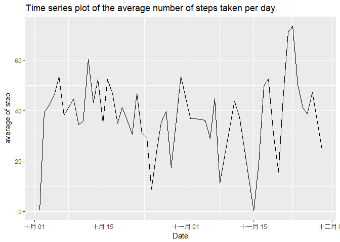

```r
library(knitr)
library(readr)
library(dplyr)
```

```
## 
## Attaching package: 'dplyr'
```

```
## The following objects are masked from 'package:stats':
## 
##     filter, lag
```

```
## The following objects are masked from 'package:base':
## 
##     intersect, setdiff, setequal, union
```

```r
library(ggplot2)
```


```r
opts_chunk$set(echo=TRUE)
```

## Loading and preprocessing the data

```r
activity <- read_csv("activity.zip",col_types = "iDi",progress = TRUE)
```
I need to load and prepare this dataset into the R.Therefore, I use read_csv to load this
data.<br>

## What is mean total number of steps taken per day?
According to the rule of Q1,so the Q1 and Q2 should ignore missing values.<br>
(this question is first question.)<br>

```r
activity %>% 
  filter(!is.na(steps)) %>%
  group_by(date) %>%
  summarise(total_step = sum(steps))%>%
  ggplot(aes(date))+
  geom_histogram(binwidth = 0.5)+
  stat_identity(aes(y = total_step),position = "identity",geom = "bar")
```

<!-- -->
<br>
This histogram show that total number of steps taken each day.<br>


```r
activity %>% 
  filter(!is.na(steps)) %>%
  group_by(date) %>%
  summarise(mean_step = mean(steps),median_step = median(steps)) %>%
  as.data.frame()
```

```
##          date  mean_step median_step
## 1  2012-10-02  0.4375000           0
## 2  2012-10-03 39.4166667           0
## 3  2012-10-04 42.0694444           0
## 4  2012-10-05 46.1597222           0
## 5  2012-10-06 53.5416667           0
## 6  2012-10-07 38.2465278           0
## 7  2012-10-09 44.4826389           0
## 8  2012-10-10 34.3750000           0
## 9  2012-10-11 35.7777778           0
## 10 2012-10-12 60.3541667           0
## 11 2012-10-13 43.1458333           0
## 12 2012-10-14 52.4236111           0
## 13 2012-10-15 35.2048611           0
## 14 2012-10-16 52.3750000           0
## 15 2012-10-17 46.7083333           0
## 16 2012-10-18 34.9166667           0
## 17 2012-10-19 41.0729167           0
## 18 2012-10-20 36.0937500           0
## 19 2012-10-21 30.6284722           0
## 20 2012-10-22 46.7361111           0
## 21 2012-10-23 30.9652778           0
## 22 2012-10-24 29.0104167           0
## 23 2012-10-25  8.6527778           0
## 24 2012-10-26 23.5347222           0
## 25 2012-10-27 35.1354167           0
## 26 2012-10-28 39.7847222           0
## 27 2012-10-29 17.4236111           0
## 28 2012-10-30 34.0937500           0
## 29 2012-10-31 53.5208333           0
## 30 2012-11-02 36.8055556           0
## 31 2012-11-03 36.7048611           0
## 32 2012-11-05 36.2465278           0
## 33 2012-11-06 28.9375000           0
## 34 2012-11-07 44.7326389           0
## 35 2012-11-08 11.1770833           0
## 36 2012-11-11 43.7777778           0
## 37 2012-11-12 37.3784722           0
## 38 2012-11-13 25.4722222           0
## 39 2012-11-15  0.1423611           0
## 40 2012-11-16 18.8923611           0
## 41 2012-11-17 49.7881944           0
## 42 2012-11-18 52.4652778           0
## 43 2012-11-19 30.6979167           0
## 44 2012-11-20 15.5277778           0
## 45 2012-11-21 44.3993056           0
## 46 2012-11-22 70.9270833           0
## 47 2012-11-23 73.5902778           0
## 48 2012-11-24 50.2708333           0
## 49 2012-11-25 41.0902778           0
## 50 2012-11-26 38.7569444           0
## 51 2012-11-27 47.3819444           0
## 52 2012-11-28 35.3576389           0
## 53 2012-11-29 24.4687500           0
```
<br>
This output is shocking for me because all median of the total number of steps taken per day is zero. many steps equal zero per day.

## What is the average daily activity pattern?

```r
activity %>% 
  filter(!is.na(steps)) %>%
  group_by(date) %>%
  summarise(mean_step = mean(steps)) %>%
  ggplot(aes(x = date,y = mean_step))+
  geom_line()+
  labs(title = "Time series plot of the average number of steps taken per day",
       x = "Date",
       y = "average of step")
```

<!-- -->
<br>
This time series plot show the average number of steps taken per day.<br>


```r
activity %>% 
  filter(!is.na(steps)) %>%
  group_by(interval) %>%
  summarise(avg_step = mean(steps)) %>%
  ggplot(aes(x = interval,y = avg_step))+
  geom_line()
```

<!-- -->
<br>
Well....Tell the truth, because English is not my native language, I am so confusing for this question.<br>
This qusetion say:Which 5-minute interval, on average across all the days in the dataset, contains the maximum number of steps?<br>
Sorry, I don't know meaning of this question. I think I calculate the mean of steps?if yes,
x-axis is interval and y-axis is mean of steps.but What is the "contains the maximum number of steps"??<br>
In conclusion, I actually am so confusing.


## Imputing missing values

```r
activity %>% 
  group_by(date) %>%
  summarise(mean_step = mean(steps),median_step = median(steps)) %>%
  as.data.frame()
```

```
##          date  mean_step median_step
## 1  2012-10-01         NA          NA
## 2  2012-10-02  0.4375000           0
## 3  2012-10-03 39.4166667           0
## 4  2012-10-04 42.0694444           0
## 5  2012-10-05 46.1597222           0
## 6  2012-10-06 53.5416667           0
## 7  2012-10-07 38.2465278           0
## 8  2012-10-08         NA          NA
## 9  2012-10-09 44.4826389           0
## 10 2012-10-10 34.3750000           0
## 11 2012-10-11 35.7777778           0
## 12 2012-10-12 60.3541667           0
## 13 2012-10-13 43.1458333           0
## 14 2012-10-14 52.4236111           0
## 15 2012-10-15 35.2048611           0
## 16 2012-10-16 52.3750000           0
## 17 2012-10-17 46.7083333           0
## 18 2012-10-18 34.9166667           0
## 19 2012-10-19 41.0729167           0
## 20 2012-10-20 36.0937500           0
## 21 2012-10-21 30.6284722           0
## 22 2012-10-22 46.7361111           0
## 23 2012-10-23 30.9652778           0
## 24 2012-10-24 29.0104167           0
## 25 2012-10-25  8.6527778           0
## 26 2012-10-26 23.5347222           0
## 27 2012-10-27 35.1354167           0
## 28 2012-10-28 39.7847222           0
## 29 2012-10-29 17.4236111           0
## 30 2012-10-30 34.0937500           0
## 31 2012-10-31 53.5208333           0
## 32 2012-11-01         NA          NA
## 33 2012-11-02 36.8055556           0
## 34 2012-11-03 36.7048611           0
## 35 2012-11-04         NA          NA
## 36 2012-11-05 36.2465278           0
## 37 2012-11-06 28.9375000           0
## 38 2012-11-07 44.7326389           0
## 39 2012-11-08 11.1770833           0
## 40 2012-11-09         NA          NA
## 41 2012-11-10         NA          NA
## 42 2012-11-11 43.7777778           0
## 43 2012-11-12 37.3784722           0
## 44 2012-11-13 25.4722222           0
## 45 2012-11-14         NA          NA
## 46 2012-11-15  0.1423611           0
## 47 2012-11-16 18.8923611           0
## 48 2012-11-17 49.7881944           0
## 49 2012-11-18 52.4652778           0
## 50 2012-11-19 30.6979167           0
## 51 2012-11-20 15.5277778           0
## 52 2012-11-21 44.3993056           0
## 53 2012-11-22 70.9270833           0
## 54 2012-11-23 73.5902778           0
## 55 2012-11-24 50.2708333           0
## 56 2012-11-25 41.0902778           0
## 57 2012-11-26 38.7569444           0
## 58 2012-11-27 47.3819444           0
## 59 2012-11-28 35.3576389           0
## 60 2012-11-29 24.4687500           0
## 61 2012-11-30         NA          NA
```
<br>
In this Q, I don't ignore missing values.
When adding the missing values, I find add the 8 days.
<br>

```r
activity %>% 
  group_by(date) %>%
  summarise(total_step = sum(steps))%>%
  ggplot(aes(date))+
  geom_histogram(binwidth = 0.5)+
  stat_identity(aes(y = total_step),position = "identity",geom = "bar")
```

```
## Warning: Removed 8 rows containing missing values (geom_bar).
```

<!-- -->
<br>I think two output(ignore and doesn't ignore missing values) is a little different.
Because days which doesn't exist NA is not affect by adding the missing values,I think
imputing missing data on the estimates of the total daily number of steps is a little
impact.<br>


## Are there differences in activity patterns between weekdays and weekends?

```r
activity$week <- weekdays(activity$date)
for(i in seq_along(activity$week)){
  if(activity$week[i]=="星期六" | activity$week[i]=="星期日"){
    activity$week[i]<-"weekend"
  }else{
    activity$week[i]<-"weekday"
  }
}
activity %>%
  filter(!is.na(steps)) %>%
  group_by(week,interval) %>%
  summarise(mean_step = mean(steps)) %>%
  ggplot(aes(x = interval,y = mean_step))+
  geom_line()+
  facet_grid(.~week)
```

<!-- -->
<br>In 500-1,000 interval,I found mean of step of weekday is more than weekend.Moreover,in 1,000-2,000 interval,I found mean of step of weekdend is more than weekday.
